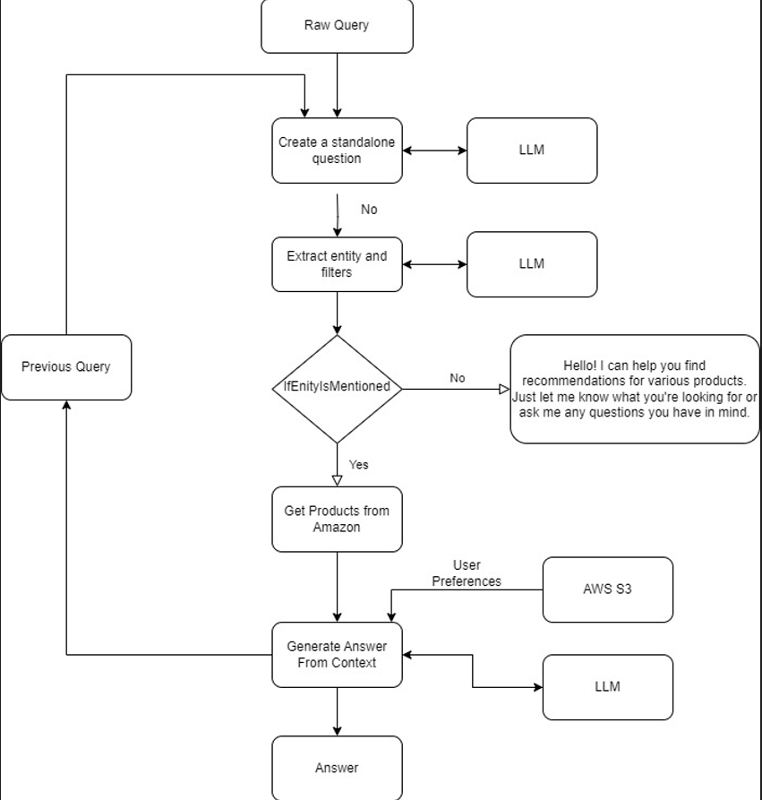

# llm-recommendation-app

# THEME: Shopping Experience Enhancement with Generative AI + AWS

## Team Name: 729950-U92A3D3B

### Team Members:
- Anuj Jadhav
- Bittu Kumar
- Pulkit Kumar Agarwal
- Animesh Maru
---

## Problem Statement

In the contemporary e-commerce landscape, consumers demand personalized and easy-to-use shopping experiences. Traditional online shopping platforms often fail to provide tailored product recommendations, leading to inefficient decision-making. The goal is to employ Generative AI and AWS technologies to enhance the Amazon shopping experience, considering factors like user preferences, previous orders, location, and chat interactions.

---

## <u>Solution:</u>

We have created a telegram bot where we curate contextual shopping experiences based on individual user's chat session and preferences. 
You can send your query to the chatbot and it will show you the best products based on the context given by you in the query.

### Demo Link: [youtube](https://ider_video_link_aayenga)

### PPT Link: [link](https://docs.google.com/presentation/d/1qAZEzYsSzj9SHvJ3ff1mM5j19BHARMyd/edit?usp=sharing&ouid=115057851485032498036&rtpof=true&sd=true)

### Flow Chart:

### You can try out the bot here: [telegram bot](https://t.me/AmazonProductSearchBot)
